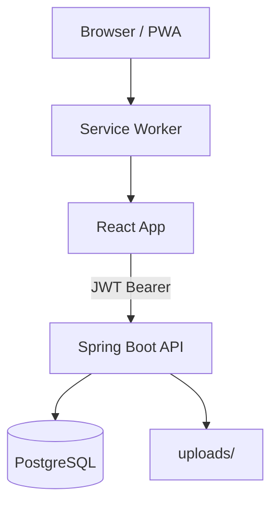

# Architecture

## Overview

Cuisenio is a **SPA + REST API** architecture:

```
┌─────────────────┐     HTTPS/JSON      ┌──────────────────┐     JDBC      ┌────────────┐
│  React SPA      │◄───────────────────►│  Spring Boot API │◄─────────────►│ PostgreSQL │
│  Vite + PWA     │   Bearer JWT        │  :8080           │               │            │
└────────┬────────┘                     └────────┬─────────┘               └────────────┘
         │                                       │
         │ Service Worker cache                  │ /uploads/** static files
         ▼                                       ▼
   Offline shell +                    Recipe images on disk
   recently viewed (local)
```

## Frontend layers

| Layer | Responsibility |
|-------|----------------|
| `pages/` | Route screens (auth, community, planner, admin) |
| `components/` | Reusable UI (Radix/shadcn-style) + domain widgets |
| `api/` | Axios clients + service modules |
| `store/` | Zustand (auth, shopping list, recently viewed) |
| `hooks/` | Data fetching, theme, optimistic mutations |
| `context/` | Notifications, i18n |

**Routing** is defined in `src/App.tsx` with lazy-loaded pages and `PrivateRoute` / `PublicRoute` guards.

## Backend packages (`Cuise-nio`)

```
com.youcode.cuisenio
├── common/          # Security, CORS, exceptions, seeders
├── features.auth/   # JWT auth, profile, admin users
├── features.recipe/ # Recipes, categories, comments, ratings, saves
└── features.mealplan/
```

## Auth model

- Stateless JWT (HS256), subject = email
- Authorities: `USER`, `ADMIN` (no `ROLE_` prefix)
- Frontend stores token in `sessionStorage` (cleared when tab closes)

## Key design decisions

1. **SPA over SSR** — faster portfolio iteration; SEO supplemented with static meta, sitemap, JSON-LD.
2. **sessionStorage over localStorage** — reduces XSS persistence window.
3. **Role forced to USER on register** — prevents privilege escalation.
4. **Code splitting** — all page routes lazy-loaded via `React.lazy`.

## Architecture diagram (Mermaid)


