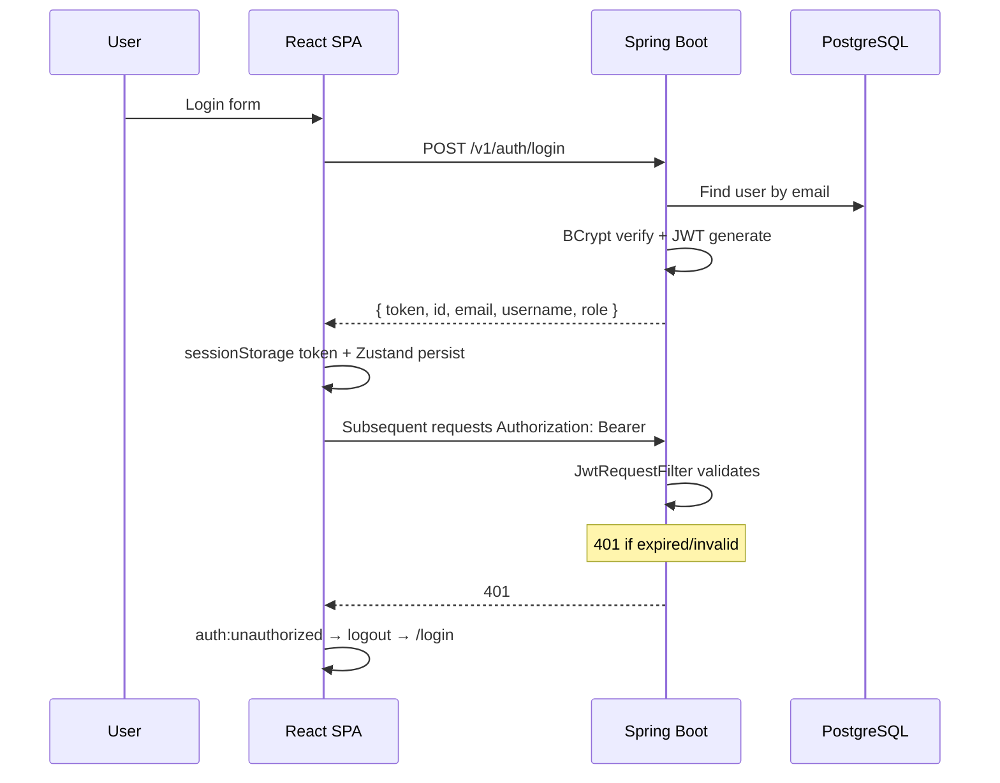

# Authentication flow

## Registration security

1. Password complexity validated (Zod frontend + Bean Validation backend).
2. Role **cannot** be set by client (privilege escalation fixed).
3. Email uniqueness enforced.

## Token storage

| Key | Storage | Purpose |
|-----|---------|---------|
| `token` | sessionStorage | Axios interceptor |
| `auth-storage` | sessionStorage (Zustand persist) | User + auth flag |

Cleared on logout and when the browser tab closes.

## Authorization

| Route | Guard |
|-------|-------|
| `/home`, `/meal-planner`, `/profile`, `/add-recipe`, `/recipe/:id` | Authenticated |
| `/dashboard` | `role === ADMIN` |
| `/login`, `/register` | Guest only (`PublicRoute`) |

## Known gaps

- No refresh token rotation
- Blocked user: existing JWT remains valid until expiry
- Password reset endpoints exist on frontend; confirm backend SMTP in deployment
